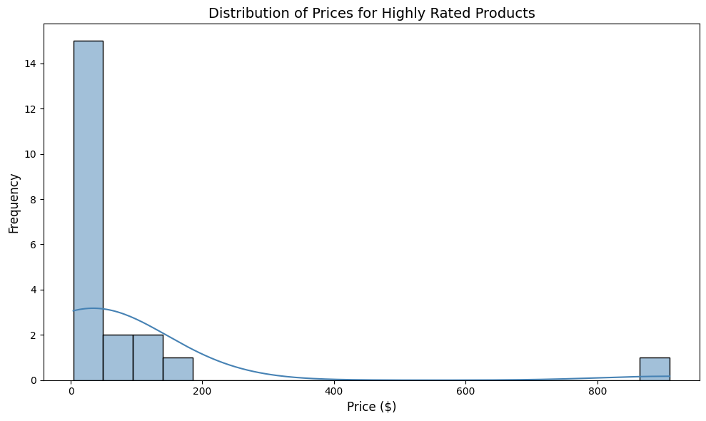
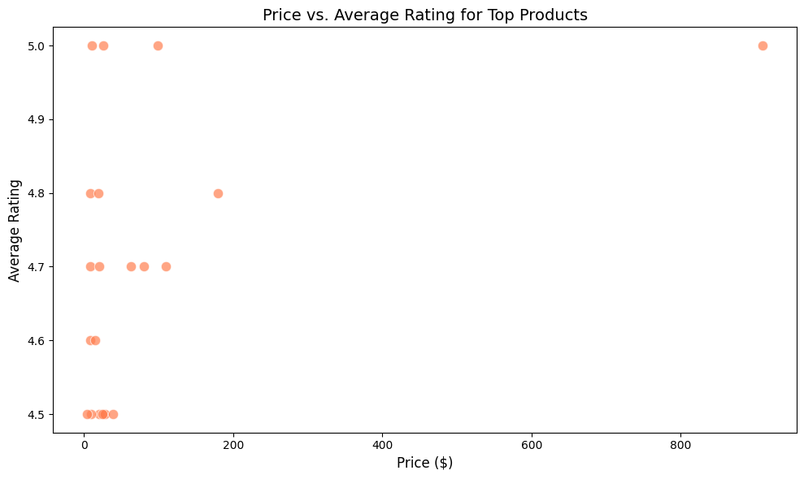
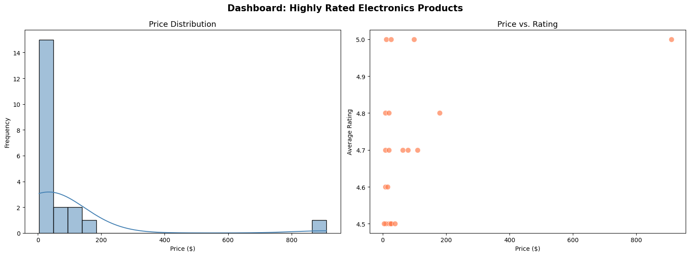

# PCEP Capstone Project: Amazon Reviews Data Analysis

> Udacity Masters in AI - Core Course #1: Introduction to Computer Programming Part 1

A data-driven capstone project at **Transformational AI**, analyzing Amazon Reviews 2023 datasets to prepare high-quality data for machine learning model fine-tuning.

## Project Overview

| Item | Detail |
|------|--------|
| Course | PCEP (Python Certified Entry-Level Programmer) |
| Dataset | [Amazon Reviews 2023](https://huggingface.co/datasets/McAuley-Lab/Amazon-Reviews-2023) - Electronics |
| Tools | Python, pandas, matplotlib, seaborn, pyarrow |
| Output | Cleaned dataset (CSV/Parquet) + visualizations |

## Project Structure

```
PCEP_Capstone_Project.ipynb    # Main notebook with all outputs
top_products.csv               # Cleaned dataset (CSV)
top_products.parquet           # Cleaned dataset (Parquet)
user_inputs.txt                # Reflection answers
histogram_prices.png           # Price distribution chart
scatterplot_price_rating.png   # Price vs. Rating chart
dashboard_combined.png         # Combined dashboard
highly_rated_dashboard.png     # Filtered high-rating dashboard
```

## What This Project Covers

1. **Environment Setup** - Python, Jupyter, library verification
2. **Data Loading** - HuggingFace streaming with sample limits, for loops with break
3. **Metadata Analysis** - Exception handling (try-except) for safe data access
4. **Data Comparison** - DataFrame columns, dtypes, .info() inspection
5. **Data Cleaning** - Boolean filtering (title + rating >= 4.5 + valid price)
6. **Visualization** - Histograms, scatterplots, combined dashboards
7. **Export** - CSV and Parquet formats for ML team

## PCEP Concepts Applied

- Variables and data types (int, float, str, bool)
- Boolean operators and comparison operators
- For loops with break for controlled iteration
- Functions with return statements
- Exception handling with try-except blocks
- Lists and append() method
- String formatting with f-strings

## Visualizations

### Price Distribution


### Price vs. Rating


### Combined Dashboard


## How to Run

```bash
pip install datasets pandas matplotlib seaborn pyarrow
jupyter notebook PCEP_Capstone_Project.ipynb
```

## License

This project is part of the Udacity Masters in AI program.
